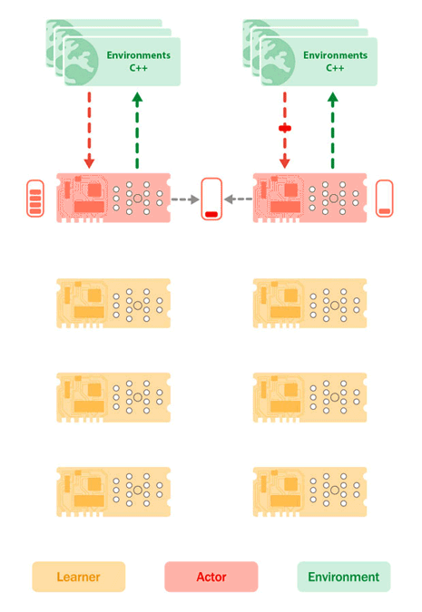
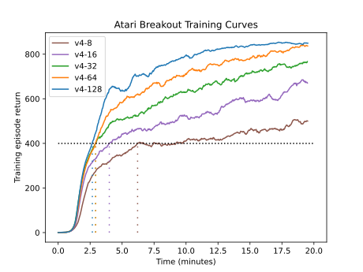
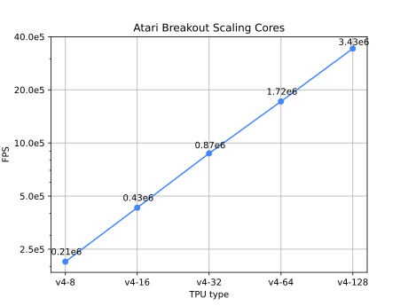
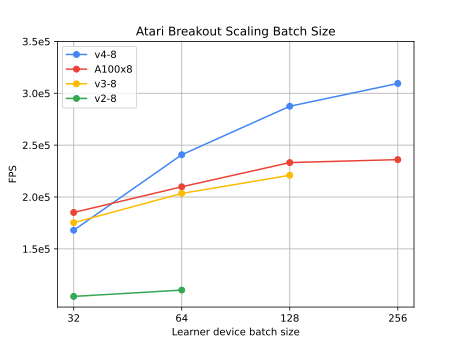
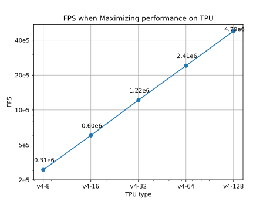
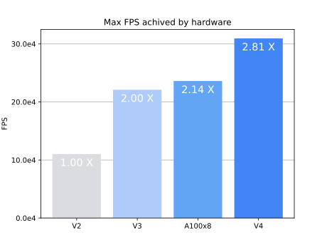

<h1 align="center">
    <p>👾 Sebulba</p>
</h1>


<h2 align="center">
    <p>An Implementation of the Sebulba Distributed RL Architecture</p>
</h2>

<div align="center">
    <a  href="">
        
    </a>
    <a href="https://github.com/psf/black">
        
    </a>
    <a href="https://github.com/instadeepai/sebulba/actions">
       
    </a>
    <a href="http://mypy-lang.org/">
        
    </a>
    <a  href="https://opensource.org/license/apache-2-0/">
        
    </a>
</div>

<div align="center">
    <h3>
      <a href="#TODO">Blog Post</a> |
      <a href="#quickstart-">Quickstart</a> |
      <a href="#architecture-">Architecture</a> |
      <a href="#benchmarks-">Benchmarks</a> |
      <a href="#acknowledgements-">Acknowledgements</a> |
      <a href="#citation-%EF%B8%8F">Citation</a>
    </h3>
</div>

We provide an implementation of Sebulba, introduced in Google DeepMind's [Podracer](https://arxiv.org/pdf/2104.06272.pdf) paper.
Sebulba uses an Actor-Learner decomposition to generate and learn from experience.
It supports arbitrary environments and co-locates acting and learning on a single TPU machine. Our
implementation of Sebulba uses the [PPO](https://arxiv.org/pdf/1707.06347.pdf) algorithm, but Sebulba can be augmented to use many popular
RL algorithms. This repo is intended to be a starting point for researchers to experiment with and
use to begin scaling their own RL agents. To get started, fork the repo, edit as
needed and run your experiments using the scripts and Makefile provided.
Feel free to star ⭐ the repo to help support the project!

This repo provides the following key features:
- 🏅 High quality implementation of Sebulba with modular components.
- 🧩 Highly configurable implementation, allowing you to adapt the system for your experiments
- 📊 Benchmarks illustrating Sebulba's performance and ability to scale.
- 📜 Logging support for both Tensorflow and Neptune.
- ☁️ Containerised to easily get up and running both locally and on GCP.

## Quickstart 🚀

### Local Quickstart
You can run Sebulba locally on your machine using docker and setting XLA flags to fake multiple devices.
This allows us to test and experiment with Sebulba on a single machine.
```bash
make docker_build_cpu

# fake 8 XLA devices
make docker_run DOCKER_VARS_TO_PASS="-e XLA_FLAGS='--xla_force_host_platform_device_count=8'" command="python experiments/sebulba_ppo_atari.py +experiment=ppo-pong +accelerators=local_8_device"
```

Then you can check your metrics on tensorboard
```
tensorboard --logdir=./logs
```

### GPU Quickstart
We use a similar setup for our runs on GPU VMs. Note that we have only carried out runs
on a single machine with A100 GPUs.

```bash
make docker_build_gpu

make docker_run command="python experiments/sebulba_ppo_atari.py +experiment=ppo-pong +accelerators=gpu_8_a100"
```

Then you can check your metrics on tensorboard
```
tensorboard --logdir=./logs
```

### TPU Quickstart
Here we outline our setup for running Sebulba on TPU VMs on GCP.

> We asume you have [gcloud](https://cloud.google.com/sdk/docs/install) installed and configured.

Set these environment variables with the desired TPU configuration.
```bash
PROJECT=my-gcp-project
ZONE=us-central1-f
ACCELERATOR_TYPE=v2-8
RUNTIME_VERSION=v2-alpha
NAME=my-sebulba-vm
```

And then use the following commands

```bash
# create the TPU POD
make create_vm
# clone repo on the TPU POD and build the image
make setup
# kill existing container, pull and run
make kill_pull_run
# start tensorboard
make start_tensorboard
# port forward tensorboard to your machine
make port_forward_tensorboard
# delete your vm
make delete
```

## Architecture 🏗

<p align="center">
    <a href="./static/architecture.gif">
        
    </a>
</p>
<p align="center">
    Fig1: Animation of the Sebulba architecture showing how data is transferred across the main
    components which are the Environments(Green) placed on the CPUs, the Actors(Red) placed on
    a subset of the TPUs and the Learners(Yellow) placed on the remaining TPU cores.
</p>

Sebulba splits the available 8 TPU cores into two disjoint sets: 𝐴 cores are used exclusively to
act, and the remaining 8 − 𝐴 cores are used to learn. Each Python thread steps an entire batch of
environments in parallel and feeds the resulting batch of observations to a TPU core, to
perform inference of that batch of observations and select the next batch of actions. The batches
of observations, actions and rewards are accumulated on the TPU cores and are then
passed to the Learners.

The learner thread executes the same update function on all the TPU cores dedicated to learning
using JAX’s pmap primitive, and parameter updates can be averaged across all participating
learner cores using JAX’s pmean/psum primitives. This computation can be scaled up via
replication across multiple TPU VMs of a POD.

### Stoppable Component
StoppableComponent represents a component running on its own thread which can be stopped.
It is designed to be subclassed, and the _run method should be overridden in the subclass to
define the specific behavior of the component. This is used for many of Sebulba's components
such as the Actor, Learner, Parameter Source and Logger.

### Actor

The Actor is a component that runs on its own thread and samples trajectories from a vectorized
environment. It uses an act function to generate actions, collects trajectory information,
and puts the trajectories into a pipeline for further processing by the Learner.

### Learner

The Learner is a component that runs on its own thread and performs
learning iterations using a pipeline of trajectories. It takes trajectory batches from the pipeline,
applies a step function across multiple devices, updates the learner's state, and logs metrics.

### Pipeline

The Pipeline component shards trajectories across a list of learner devices.
Trajectories are put into a queue by sharding them across the learner devices, and they are
retrieved from the queue in their original form.

### Params Source

The ParamsSource class is a component that runs on its own thread and serves as a means of passing
parameters between Learner and Actor components. It ensures that the parameters given to the
Actor are ready for use. The class initializes with an initial parameter value and a JAX device,
and it provides methods to update and retrieve the current parameter value.
The update method allows for setting new parameter values, and the get method returns
the current parameter value.

## Benchmarks 📈

### Breakout Convergence

<p align="center">
    <a  href="./static/breakout_convergence_scaling_cores_episode_return.svg" align="center">
        
    </a>
</p>
<p align="center">
    Fig2: Learning curves of Sebulba PPO on Atari Breakout scaling TPU cores [8-128].
</p>
In Figure 2 we can see the effect of scaling the number of TPU cores on the convergence of our PPO
agent on the Atari Breakout environment. Not only does our agent converge faster with more cores,
due to the increase of the effective batch size, our agents training becomes more stable and
continues to push past the learning plateau that we see with fewer cores.

<p align="center">
    <a  href="./static/breakout_convergence_scaling_cores_fps.svg" align="center">
        
    </a>
</p>
<p align="center">
    Fig3: Effect of scaling TPU cores on the Frames Per Second of Sebulba PPO for Atari Breakout.
</p>
Figure 3 shows the impressive linear scaling of the Sebulba architecture as we increase the number of
TPU cores.

### Scaling batch size

<p align="center">
    <a  href="./static/breakout_performance_scaling_batch_size_fps.svg" align="center">
        
    </a>
</p>
<p align="center">
    Fig4: Effect of scaling batch size on the Frames Per Second of Sebulba PPO for Atari Breakout across different hardware.
</p>
Figure 4 also shows how Sebulba PPO scales with batch size across different hardware. However, we can
see that scaling batch size can only go so far and begins to plateau or simply grow to large to fit
on memory of specific hardware. At this point it becomes more viable to scale the number of TPU replicas
or increase model capacity for further improvements.

### Maximising Throughput

<p align="center">
    <a  href="./static/breakout_performance_scaling_cores_fps.svg" align="center">
        
    </a>
</p>
<p align="center">
    Fig5: Effect of scaling batch size on the Frames Per Second of Sebulba PPO for Atari Breakout
when we optimise system parameters for throughput instead of balancing for convergence.
</p>
As well our results maximising wall clock time of model convergence, we found that we could
further increase our max throughput of Sebulba by tuning system parameters for throughput instead
of convergence. Doing this, we can increase our max throughput by almost 33%, going from 3.8M FPS to 4.8M FPS!

### Hardware Comparison

<p align="center">
    <a  href="" align="center">
        
    </a>
</p>
<p align="center">
    Fig6: Comparison of max FPS achieved on each hardware platform. For A100x8 we used a a2-highgpu-8g instance on GCP.
</p>

In Figure 6 we compare the max FPS achieved on each hardware platform. These show the max FPS achieved
on each platform with the 8 device configuration. For A100x8 we used a a2-highgpu-8g instance on GCP.
For TPU v2, v3 and v4 we use only 8 cores for a fairer comparison.

### Reproduction

To reproduce our benchmarck you follow the on TPU quickstart and set the `EXPERIMENT_NAME` environment variable to one of the experiment in `experiments/config/experiment`.

```bash
EXPERIMENT_NAME=tpu-v4-max-convergence
make kill_pull_run
```

> Our benchmark are performed on a single NUMA node for stability.
> You can edit the USE_ONLY_NUMA_NODE0 variable on the makefile to use all the CPUs available.

## Acknowledgements 🙏

We thank [Google's TPU Research Cloud Program](https://sites.research.google/trc/about/) for supporting this work and providing access
to TPU hardware 🌩️. We also like to thank [CleanRL](https://github.com/vwxyzjn/cleanrl/tree/master) 🧽
for providing a fantastic implementation of [PPO](https://github.com/vwxyzjn/cleanrl/blob/master/cleanrl/ppo_atari_envpool.py)
which was used as a refernece and adapted for our implementation of PPO.

## Citation ✏️

```bibtex
@misc{picard2023,
  author = {Armand Picard and Donal Byrne and Alexandre Laterre},
  title = {Sebulba: Scaling reinforcement learning on cloud TPUs in JAX},
  year = {2023},
  publisher = {GitHub},
  url = {https://github.com/instadeepai/sebulba}
}
```
